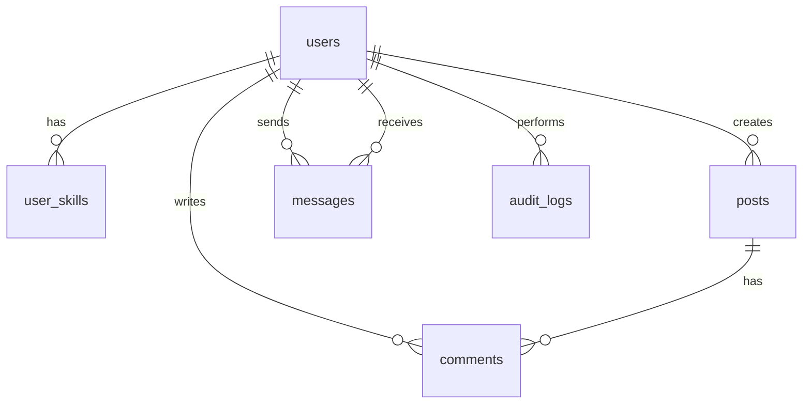

# 📚 Social Network Application Database Documentation

## 🚀 Overview
The database serves as the backbone of the social network application, managing **users**, **posts**, **comments**, **messages**, **user skills**, and **audit logs**. It is designed using **SQLite** with a focus on:
- 🛠 **Performance**: Utilizing indexes to speed up queries.
- 🔒 **Data Integrity**: Enforced through constraints and foreign keys.
- 🌐 **Ease of Integration**: Simplified for frontend developers.

This document provides a comprehensive yet straightforward explanation of the database structure, accompanied by visual aids to enhance understanding.

---

## 🗂 Table Summary
The following table summarizes the tables, their purposes, and associated indexes:

| Table            | Purpose                              | Key Columns                               | Indexes                      |
|-------------------|--------------------------------------|-------------------------------------------|------------------------------|
| `users`          | Manage user data                     | `id`, `email`, `role`, `photo`            | `idx_users_email`            |
| `user_skills`    | Store user skills                    | `user_id`, `skill`                        | -                            |
| `posts`          | Manage posts                         | `id`, `title`, `content`, `user_id`       | `idx_posts_user_id`          |
| `messages`       | Store messages between users          | `id`, `content`, `sender_id`, `receiver_id` | `idx_messages_sender_id`, `idx_messages_receiver_id` |
| `comments`       | Manage comments on posts             | `id`, `content`, `user_id`, `post_id`     | `idx_comments_post_id`, `idx_comments_user_id` |
| `audit_logs`     | Track administrative activities       | `id`, `action`, `admin_id`, `created_at`  | -                            |

---

## 🖼 Database Structure (Diagram)
To visualize the relationships between tables, the following diagram (created using [Mermaid](https://mermaid.js.org/)) can be used:

📌 **How to View the Diagram**:
- Copy the code above into the [Mermaid Live Editor](https://mermaid.live/) to render the diagram.
- The relationships show how tables are linked via foreign keys (e.g., `user_id`, `post_id`).

---

## 📋 Table Details

### 1. Table `users` (Users)
**Purpose**: Store user data and roles.

#### Columns:
- `id`: 🆔 Unique identifier (primary key, auto-incremented).
- `first_name`: ✍️ First name (required).
- `last_name`: ✍️ Last name (required).
- `email`: 📧 Unique email address (required).
- `password`: 🔑 Encrypted password (required).
- `department`: 🏢 Department/Major (required).
- `photo`: 🖼 Profile picture URL (optional).
- `role`: 🎭 User role (`user` or `admin`, default: `user`).

#### Indexes:
- `idx_users_email`: Speeds up email-based searches.

#### Frontend Tips:
- 📋 Use a registration form with email uniqueness validation.
- 🖼 Support image uploads with a default image for `photo`.
- 🎨 Display `role` as a dropdown menu.

---

### 2. Table `user_skills` (User Skills)
**Purpose**: Associate users with their skills.

#### Columns:
- `user_id`: 🆔 User ID (foreign key).
- `skill`: 💡 Skill name (required).
- **Primary Key**: (`user_id`, `skill`).

#### Relationships:
- 🧩 `user_id` links to `users(id)` with automatic deletion (`ON DELETE CASCADE`).

#### Frontend Tips:
- 📑 Display skills as an editable list in the user profile.
- 🔍 Add skill-based filtering in the search interface.

---

### 3. Table `posts` (Posts)
**Purpose**: Manage posts created by users.

#### Columns:
- `id`: 🆔 Unique identifier (primary key).
- `title`: 📜 Post title (required).
- `content`: 📝 Post content (required).
- `image`: 🖼 Image URL (optional).
- `created_at`: 🕒 Creation timestamp (required).
- `user_id`: 🆔 User ID (foreign key).

#### Relationships:
- 🧩 `user_id` links to `users(id)` with automatic deletion.

#### Indexes:
- `idx_posts_user_id`: Speeds up post retrieval by user.

#### Frontend Tips:
- 🖼 Display images if available, with a default placeholder.
- 🕒 Format `created_at` using libraries like `date-fns`.
- 👤 Include a link to the post author’s profile.

---

### 4. Table `messages` (Messages)
**Purpose**: Manage messages between users.

#### Columns:
- `id`: 🆔 Unique identifier (primary key).
- `content`: 📝 Message content (required).
- `created_at`: 🕒 Sent timestamp (required).
- `sender_id`: 🆔 Sender ID (foreign key).
- `receiver_id`: 🆔 Receiver ID (foreign key).

#### Relationships:
- 🧩 `sender_id` and `receiver_id` link to `users(id)` with automatic deletion.

#### Indexes:
- `idx_messages_sender_id`, `idx_messages_receiver_id`: Speed up message queries.

#### Frontend Tips:
- 💬 Design a chat interface with chronological ordering.
- 🔔 Add notifications for new messages.

---

### 5. Table `comments` (Comments)
**Purpose**: Manage comments on posts.

#### Columns:
- `id`: 🆔 Unique identifier (primary key).
- `content`: 📝 Comment content (required).
- `created_at`: 🕒 Creation timestamp (required).
- `user_id`: 🆔 User ID (foreign key).
- `post_id`: 🆔 Post ID (foreign key).

#### Relationships:
- 🧩 `user_id` links to `users(id)`, and `post_id` links to `posts(id)` with automatic deletion.

#### Indexes:
- `idx_comments_post_id`, `idx_comments_user_id`: Speed up comment queries.

#### Frontend Tips:
- 📜 Display comments below posts with user avatars.
- 🔄 Add a "load more" feature for comments.

---

### 6. Table `audit_logs` (Audit Logs)
**Purpose**: Track administrative activities.

#### Columns:
- `id`: 🆔 Unique identifier (primary key).
- `action`: 🔧 Action performed (required).
- `resource_type`: 📋 Resource type (required).
- `resource_id`: 🆔 Resource ID (required).
- `admin_id`: 🆔 Admin ID (foreign key, optional).
- `details`: 📝 Additional details (optional).
- `created_at`: 🕒 Action timestamp (required).

#### Relationships:
- 🧩 `admin_id` links to `users(id)` with `NULL` on deletion.

#### Frontend Tips:
- 🖥 Design an admin dashboard to display logs.
- 🔍 Add filtering by `action` or `resource_type`.

---

## 🛠 Frontend Development Tips
1. **Image Management** 📷:
   - Use libraries like `react-dropzone` for image uploads.
   - Store image paths in `users.photo` and `posts.image`.

2. **Dates** 🕒:
   - Use `moment.js` or `date-fns` to format `created_at`.

3. **Performance** ⚡:
   - Implement pagination for posts and comments.
   - Leverage indexes to optimize queries.

4. **Security** 🔐:
   - Verify `role` before allowing admin actions.
   - Implement input validation.

5. **User Experience** 🌟:
   - Add real-time notifications for messages and comments.
   - Support interactive features like "likes" if requested.

---

## 🎯 Conclusion
The database is designed to be **flexible**, **efficient**, and **easy to integrate**. The tables, relationships, and indexes facilitate building interactive user interfaces. Use the diagram and table summary above to understand the structure, and reach out to the backend development team for any additional questions.